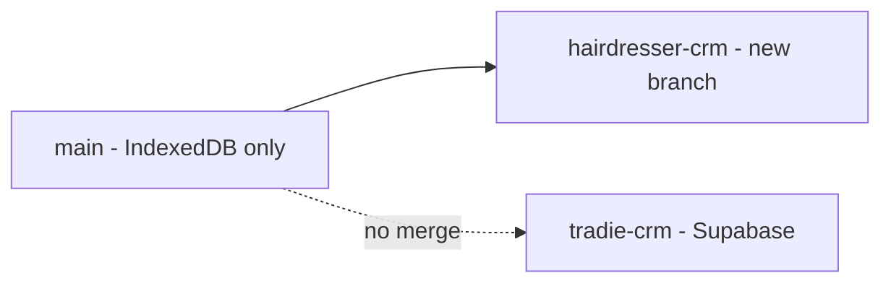

# Hairdresser CRM Supabase integration plan

## Goals

- Keep **main** and **tradie-crm** completely separate; no merges.
- Add Supabase to the Hairdresser CRM on a new branch **hairdresser-crm**.
- Use the existing Supabase **hairdresser** schema and populate it with the correct tables and fields.

## Branch strategy

- **Create branch `hairdresser-crm` from `main**` (do not modify main directly).
- All Supabase work happens on `hairdresser-crm`. Main stays as the stable, IndexedDB-only version until the new stack is validated.

---

## Phase 1: Git setup

1. Ensure you are on `main` and it is up to date: `git checkout main && git pull origin main`.
2. Create and switch to the new branch: `git checkout -b hairdresser-crm`.
3. Push the branch (optional, for backup): `git push -u origin hairdresser-crm`.

No further commits to `main` for this feature; all commits stay on `hairdresser-crm`.

---

## Phase 2: Supabase `hairdresser` schema

Create the following in the **hairdresser** schema (Supabase SQL Editor or migrations). Use **snake_case** in the database; the app can map to/from camelCase in code.

### 2.1 Table: `hairdresser.customers`

| Column            | Type        | Notes                                     |
| ----------------- | ----------- | ----------------------------------------- |
| id                | bigint      | Primary key, GENERATED ALWAYS AS IDENTITY |
| first_name        | text        |                                           |
| last_name         | text        |                                           |
| contact_number    | text        |                                           |
| social_media_name | text        | nullable                                  |
| referral_notes    | text        | nullable                                  |
| referral_type     | text        | nullable                                  |
| updated_at        | timestamptz | default now()                             |

- Indexes (for search and sorting): `last_name`, `first_name`, `contact_number`, `updated_at`.

### 2.2 Table: `hairdresser.appointments`

| Column      | Type        | Notes                                                      |
| ----------- | ----------- | ---------------------------------------------------------- |
| id          | bigint      | Primary key, GENERATED ALWAYS AS IDENTITY                  |
| customer_id | bigint      | NOT NULL, FK → hairdresser.customers(id) ON DELETE CASCADE |
| start       | timestamptz | NOT NULL                                                   |
| end         | timestamptz | nullable                                                   |
| title       | text        | nullable                                                   |
| created_at  | timestamptz | default now()                                              |

- Indexes: `customer_id`, `start`, composite `(customer_id, start)` for “next appointment per customer” queries (see [js/db.js](js/db.js) lines 181–184, 408–409).

### 2.3 Table: `hairdresser.notes`

| Column      | Type             | Notes                                                      |
| ----------- | ---------------- | ---------------------------------------------------------- |
| id          | bigint           | Primary key, GENERATED ALWAYS AS IDENTITY                  |
| customer_id | bigint           | NOT NULL, FK → hairdresser.customers(id) ON DELETE CASCADE |
| date        | date             |                                                            |
| created_at  | date/timestamptz |                                                            |
| edited_date | date             | nullable                                                   |
| svg         | text             | note content                                               |
| note_number | int              | nullable                                                   |

- Indexes: `customer_id`, `created_at` (see [js/db.js](js/db.js) notes store and indexes).

### 2.4 Table: `hairdresser.note_versions` (optional but recommended)

| Column      | Type        | Notes                                        |
| ----------- | ----------- | -------------------------------------------- |
| id          | bigint      | Primary key, GENERATED ALWAYS AS IDENTITY    |
| note_id     | bigint      | FK → hairdresser.notes(id) ON DELETE CASCADE |
| svg         | text        |                                              |
| edited_date | date        | nullable                                     |
| saved_at    | timestamptz | NOT NULL                                     |

- Indexes: `note_id`, `saved_at`.

### 2.5 Table: `hairdresser.images`

Current app stores images as base64 in IndexedDB ([js/db.js](js/db.js) ~355–361). Two options:

- **Option A (simplest):** One table with a `data_url` text column (same as current). Easiest migration; large rows.
- **Option B (recommended long-term):** Table for metadata + Supabase Storage for files:
  - Columns: `id`, `customer_id` (FK), `name`, `type` (e.g. MIME), `storage_path` (object key in bucket), `created_at`.
  - Create a Storage bucket (e.g. `hairdresser-images`) and store files there; use `storage_path` in the table.

Recommendation: align with **tradie-crm** (if it uses Storage, use Option B for hairdresser; otherwise Option A for parity).

### 2.6 Row Level Security (RLS)

- Enable RLS on all tables in `hairdresser`.
- Add policies that allow the same access pattern as the current app (e.g. authenticated user or anon key with a single-tenant policy, depending on how tradie-crm is set up). Mirror tradie-crm’s RLS approach for consistency.

---

## Phase 3: Code integration on `hairdresser-crm`

Integration should follow the **same pattern as tradie-crm** (same Supabase client setup, env usage, and data layer shape).

1. **Dependencies**
  - Add `@supabase/supabase-js` (or the same package used on tradie-crm) in the project (e.g. via a package manager if you introduce one, or script tag if the app is script-only).
2. **Configuration**
  - Supabase URL and anon key: use environment variables or a small config file (e.g. `js/config.js` or build-time env), not committed secrets. Same approach as tradie-crm.
3. **Data layer**
  - **Option A:** New module (e.g. `js/db-supabase.js`) that implements the same API surface as [js/db.js](js/db.js) (e.g. `createCustomer`, `getAllCustomers`, `createAppointment`, notes, images) but backed by Supabase using the `hairdresser` schema. App entrypoint or a single “backend” switch chooses `ChikasDB` (IndexedDB) vs Supabase.
  - **Option B:** Refactor [js/db.js](js/db.js) to accept an adapter (IndexedDB vs Supabase) and swap based on config. More invasive.
   Recommendation: Option A so main’s `db.js` is untouched and hairdresser-crm only adds and wires the Supabase adapter.
4. **Schema/table naming in code**
  - Supabase uses `hairdresser.customers` etc. In the client, use the full schema in queries (e.g. `.from('customers')` with schema set to `hairdresser` in the client or in each call, per Supabase API).
  - Map between **camelCase** (app) and **snake_case** (DB) in the adapter (e.g. `firstName` ↔ `first_name`, `customerId` ↔ `customer_id`).
5. **Images**
  - If using Option B (Storage): upload blob to Storage, insert row with `storage_path`; for reads, get signed URL or public URL and expose the same shape (e.g. `dataUrl` or blob) that the UI expects so [js/app.js](js/app.js) needs minimal or no changes.
6. **Notes and note versions**
  - Implement `createNote`, `updateNote`, `getNotesByCustomerId`, `getNotePreviousVersion`, `restoreNoteToPreviousVersion` in the Supabase adapter, using `hairdresser.notes` and `hairdresser.note_versions`.
7. **No changes to main**
  - All edits are confined to the `hairdresser-crm` branch; `main` is not modified.

---

## Phase 4: Validation

- Run the app from `hairdresser-crm` against the Supabase `hairdresser` schema (and Storage if used).
- Verify: create/edit/delete customers, appointments, notes, note versions, and images; backup/export if applicable.
- When satisfied, you can later make `hairdresser-crm` the default experience (e.g. merge into `main` or replace `main`), as a separate decision; this plan does not change `main` until you choose to.

---

## Summary

| Step | Action                                                                                                                                                           |
| ---- | ---------------------------------------------------------------------------------------------------------------------------------------------------------------- |
| 1    | Create branch `hairdresser-crm` from `main`.                                                                                                                     |
| 2    | In Supabase, create `hairdresser` tables: `customers`, `appointments`, `notes`, `note_versions`, `images` (and optionally Storage bucket), plus indexes and RLS. |
| 3    | On `hairdresser-crm`, add Supabase client and config (same pattern as tradie-crm).                                                                               |
| 4    | Implement a Supabase-backed data layer for the `hairdresser` schema that mirrors the existing [js/db.js](js/db.js) API and wire the app to use it.               |
| 5    | Test thoroughly on `hairdresser-crm`; leave `main` unchanged.                                                                                                    |

This keeps main and tradie-crm separate and gets the Hairdresser CRM onto Supabase in a controlled way on a dedicated branch.